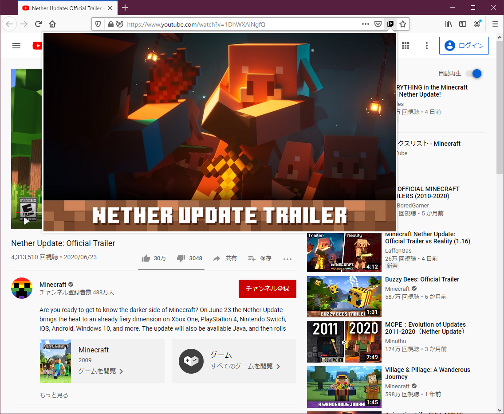

# YouTube Thumbnail Viewer

Adds a YouTube thumbnail preview icon to the address bar.

## Development

1. Install dependencies: `npm ci`
2. Lint: `npm run lint`
3. Format: `npm run format`
4. Run in Firefox for local testing: `npm run start:firefox`

## Build

- Build the extension package: `npm run build`  
  This runs `web-ext build --overwrite-dest` and outputs artifacts under `web-ext-artifacts`.

## Release

1. Ensure lint/format are clean: `npm run lint` and `npm run format`
2. Bump the version in `manifest.json` (and `package.json` if you keep them in sync)
3. Build the package: `npm run build`
4. Upload the generated artifact from `web-ext-artifacts` to AMO

## Screenshots

